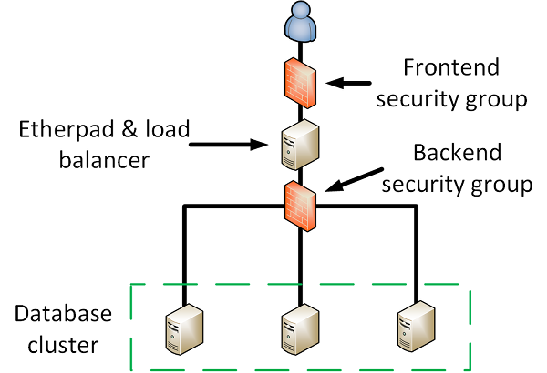

# Etherpad deployment demo

#### Table of Contents

1. [Overview](#overview)
2. [Requirements](#requirements)
3. [Usage](#usage)
4. [Technical details](#technical-details)
    * [Tricks used](#tricks-used)
    * [Caveats](#caveats)
5. [Contributors](#contributors)

## Overview

This repository contains Ansible playbooks for deploying Etherpad with a Galera
backend using Heat and Docker. This is mainly meant to be an example on how to
use these tools together, but you could also potentially use this to deploy an
Etherpad application on OpenStack.

**If you are going to use the code here as an example, please read the "Caveats"
chapter below.**

## Requirements

* Ansible >= 2.2
* shade >= 1.8.0

For instructions on how to install Ansible, see [the official
documentation](https://docs.ansible.com/).

Shade is a client library used by Ansible to communicate with OpenStack clouds.
The easiest way to install it is using pip:

```bash
$ pip install shade
```

In addition to the software listed, you will also need access to an OpenStack
cloud. The project you use for deployment needs to have a network and a router
in place. If floating IPs are available for your project then this should
already be the case.

## Usage

First you'll need to clone this repository to a directory on your machine. We
will refer to the root of the cloned repository with `etherpad-deployment-demo`
later in this text.

Install the third party Ansible roles used:

```bash
$ ansible-galaxy -r requirements.yml install
```

You will need to get an openrc file from OpenStack so that Ansible can interact
with it. The easiest way to get it is to login to the web interface and go to
Compute -> Access & Security -> API Access -> Download OpenStack RC File. Once
you have the file, you will need to source it (the name of the file may be
different):

```bash
$ source openrc.sh
```

After that you can fill in the parameters for the Heat stack. First copy the
example Heat parameter file to your current working directory:

```bash
$ cd etherpad-deployment-demo
$ cp files/example-heat-params.yml my-heat-params.yml
```

Edit the file with your favorite editor and fill in all the variables. You can
find documentation about the variables in the Heat template under
`files/etherpad-heat-stack.yml`.

Once you have completed the steps above, you are ready to spin up the stack in
OpenStack. You will need to specify the location of the Heat parameter file you
filled in (it's safest to use the absolute path) and the name of the network
you filled in in your Heat parameters:

```bash
$ ansible-playbook site.yml \
  -e "heat_environment_file=<your heat parameter file> \
      etherpad_network_name=<the openstack network shared by instances>"
```

The default user account name used to log in to virtual machines is
"cloud-user". If the images you are using have a different default user account
name, then you will need to also set the `vm_user_account` variable.

## Technical details

The playbooks here will spin up the following stack:



The setup of Etherpad is split into stages that are implemented as separate
playbooks. You can find these playbooks under the `playbooks/` directory. These
are all gathered together in the correct order in `site.yml`. The stages are as
follows:

1. Start Heat stack
2. Configure database cluster
3. Configure HAproxy and Etherpad

You can follow the flow of execution by starting from `site.yml` and reading the
included playbooks in the order listed.

### Tricks used

**Start a Heat stack and create an Ansible inventory dynamically out of its
outputs.**

In the `outputs` section of the Heat template, you'll find an example on how to
get data out from Heat after its done with its deployment. This output is
placed into an Ansible variable using the `register` keyword. The variable is
then used to dynamically add the freshly created hosts to Ansible's inventory.
The `add_host` module is used for this. An inventory file is also generated
(`etherpad_inventory`), though this is not used during the Ansible run. It can
be used once the stack is running for troubleshooting purposes.

**Connection to hosts with no public IP through a bastion host.**

The virtual machine used to host Etherpad is also used as a bastion host to
connect to the database backend. This is achieved by using the ProxyCommand
feature of SSH. The ProxyCommand option is filled in using
`ansible_ssh_common_args` set in the context of the database cluster nodes (see
`group_vars/`).

**Automatic generation of passwords.**

The database passwords required are generated automatically using Ansible's
`lookup` function. This function generates a password and puts it in a file
under `playbooks/credentials`. If the file is already in place, the password in
it will be used instead. You can see this in the database configuration
playbook.

### Caveats

Some shortcuts were taken to finish these playbooks in time for a live demo, so
if you want to use this repo as an example you should be aware of the following
caveats. First of all a caveat about this list: it is almost certainly not
complete, and there are other things that could be done better as there always
are. As a general principle, you should not copy implementation details from an
example without understanding the implications.

**Bad Docker image and container management.**

There is an actual set of modules for managing Docker images and containers.
These are not used here, but they should be. What is done here instead is
running Docker commands directly using `shell` or `command`. For documentation
on the proper way to do manage Docker from Ansible, see
[Ansible's
documentation](https://docs.ansible.com/ansible/list_of_cloud_modules.html#docker).

**Broken load balancing to the database cluster.**

The configuration for the load balancing to the database cluster in HAproxy
will be something like this:

```
listen galera_cluster
  bind 127.0.0.1:3306
  mode tcp
  balance source
    server galera_node0 192.168.1.176:3306 check
    server galera_node1 192.168.1.174:3306 check
    server galera_node2 192.168.1.177:3306 check
```

Due to the way Galera works, **this will not work properly if one of the
backend nodes fails**. What is being done here is dead simple load balancing in
TCP mode.  However, there is no guarantee that a cluster member that has port
3306 open is able to serve requests. If you want to use HAproxy for load
balancing to a Galera cluster, you will need to configure a script in a
different port on the cluster nodes that will respond with the status of the
database node with an HTTP status. Something like this:

```
listen galera_cluster
  bind 127.0.0.1:3306
  mode tcp
  balance roundrobin
  option httpchk
  server galera_node0 192.168.1.176:3306 check port 9200 inter 2000 rise 2 fall 5
  server galera_node1 192.168.1.174:3306 backup check port 9200 inter 2000 rise 2 fall 5
  server galera_node2 192.168.1.177:3306 backup check port 9200 inter 2000 rise 2 fall 5
```

Here there is a service in port 9200 that reports on the status of the cluster
node. Because the check uses HTTP, `option httpchk` is set. With these
playbooks, the service in port 9200 doesn't exist, so this configuration cannot
be copied without setting that up first. You should be able to find
documentation on how to do that by searching for keywords like e.g. "haproxy
galera cluster load balancing".

Another way to configure the load balancing is documented in [the Galera
cluster documentation on
HAproxy](http://galeracluster.com/documentation-webpages/haproxy.html).

**No affinity setting for the Galera cluster nodes.**

If you want to create a production database cluster in OpenStack, you need to
ensure that all virtual machines end up on different physical servers. This is
possible in OpenStack by using server groups and setting the affinity policy
for the server group to anti-affinity. This can be done in Heat by using the
`OS::Nova::ServerGroup` resource. This is not currently done by this deployment
example.

## Contributors

  * Risto Laurikainen - https://github.com/rlaurika
